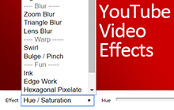

# Youtube Video Effects (Chrome Extension)
 

Youtube Video Effects provides you realtime video effects on YouTube. 
## Features:

⭐️ Fullscreen Support

⭐️ Control effect parameters with range sliders

⭐️ Interact some effects with the cursor (Such as Swirl, Bulge/Pinch)

⭐️ Does not mess with subtitles of annotations

⭐️ Completely free and with no ads

## Available Effects:
- Brightness / Contrast
- Hue / Saturation
- Vibrance
- Denoise
- Unsharp Mask
- Noise
- Sepia
- Vignette
- Zoom Blur
- Triangle Blur
- Lens Blur
- Swirl
- Bulge / Pinch
- Ink
- Edge Work
- Hexagonal Pixelate
- Dot Screen
- Color Halftone

------------
Like Youtube Video Effects? Rate us ⭐️⭐️⭐️⭐️⭐️
------------

Q: How do I use Youtube Video Effects?
A: Just install our extension and keep using Youtube as usual. The FX button will automatically appear next to the three dots icon.

Q: How does it work?
A: This extension is possible thanks to a JavaScript library called glfx.js (Created by Evan Wallace, http://evanw.github.io/glfx.js) The library uses WebGL, which is an API for rendering interactive graphics in browser. 

Found a bug? Got a suggestion?
https://github.com/onurkerimov/youtube-video-effects/issues

------------
Made with ❤️ by Onur Kerimov
